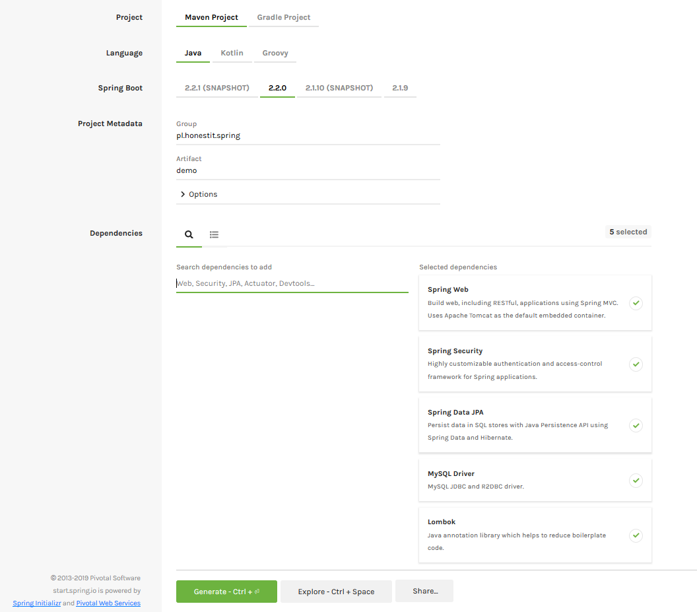

[< Powrót](../README.md)

Wstecz | [Dalej](../module_2/README.md)

## Moduł 1. Podstawowa konfiguracja projektu

W pierwszej kolejności zajmiemy się przygotowaniem projektu do dalszych prac. Musimy zadbać o to, aby w naszym projekcie:
- pojawiły się wszystkie zależności,
- pojawiły się wszystkie wymagane konfiguracje.

---

### Zadanie 1.1. Wygenerowanie projektu

Korzystając ze Spring Boot możemy spróbować ręcznie stworzyć projekt, od zera, ale nie jest to potrzebne. Do automatycznego utworzenia projektu wykorzystamy stronę [start.spring.io](https://start.spring.io).

Założenia:
- tworzymy projekt Maven'a dla Java'y,
- wybieramy najnowszą wersją Spring Boot,
- określamy grupę `pl.honestit.spring`,
- określamy artefakt `demo`,
- dodajemy zależności do:
  - `Web`
  - `Security`
  - `JPA`
  - `MySQL` (lub `Postgres` lub `H2`)
  
  > Możemy również dodać zależności do `Lombok`, jeżeli biblioteka ta jest nam znana.

Generujemy projekt i powstałe archiwum rozpakowujemy. Na podstawie tego archiwum za chwilę utworzymy nowy projekt w IntelliJ.



:hamster: [A tutaj znajdziesz startową wersję projektu](https://github.com/honestit/SDA_JAVA_WRO_23_SPRING_INTRO/tree/79134ecca449c993555a42121491fedfefcc6fe4/projects/honestit/demo)

---

### Zadanie 1.2. Utworzenie nowego projektu w IntelliJ

W IntelliJ tworzymy nowy projekt na podstawie istniejących źródeł, a więc rozpakowanego archiwum wcześniej wygenerowanego projektu.

Należy pamiętać, aby w projekcie były ustawione następujące elementy:
- wersja SDK na Java `1.8` lub `1.11`,
- katalog `src/main/java` oznaczony jako katalog ze źródłami (_Sources Root_),
- katalog `src/main/resources` oznaczony jako katalog z zasobami (_Resources Root_),
- utworzony katalog `src/main/webapp`, w którym będziemy tworzyć widoki JSP.

:hamster: [Mam dla Ciebie skonfigurowany projekt z tymi wszystkimi pitu-pitu!](https://github.com/honestit/SDA_JAVA_WRO_23_SPRING_INTRO/tree/062f3feec0803529467bfd52b2974e69ce42239d/projects/honestit/demo)

---

### Zadanie 1.3. Konfiguracja Maven'a pod technologię JSP

Ze względu na to, że w projekcie będziemy wykorzystywać strony JSP, to musimy rozszerzyć zestaw wykorzystywanych zależności o bibliotekę JSTL oraz wsparcie dla przetwarzania stron JSP. Strona `start.spring.io` nie umożliwia nam dodania takich zależności.

1. Do pliku `pom.xml` dodajemy poniższe zależności:

    **Biblioteka JSTL:**

    ```xml
            <dependency>
                <groupId>jstl</groupId>
                <artifactId>jstl</artifactId>
                <version>1.2</version>
            </dependency>
    ```

    **Wsparcie dla stron JSP:**

    ```xml
            <dependency>
                <groupId>org.apache.tomcat.embed</groupId>
                <artifactId>tomcat-embed-jasper</artifactId>
            </dependency>
    ```
    
[Rozwiązanie zadania](resolutions/1.3.md)

:hamster: [Tutaj jest cały projekt, który udało nam się do tej pory ogarnąć](https://github.com/honestit/SDA_JAVA_WRO_23_SPRING_INTRO/tree/151319c76c5e7a24857969c513243fe136a45d51/projects/honestit/demo)

:hamster: [... a tutaj sam plik pom.xml](https://github.com/honestit/SDA_JAVA_WRO_23_SPRING_INTRO/blob/151319c76c5e7a24857969c513243fe136a45d51/projects/honestit/demo/pom.xml)

---

### Zadanie 1.4. Test działania

W celu zweryfikowania czy projekt został poprawnie skonfigurowany przygotujemy sobie testową stronę powitalną. Będzie to zwykła strona HTML. Można wykorzystać poniższy kod strony lub napisać własną:

```html
<!DOCTYPE html>
<html lang="pl">
<head>
    <meta charset="UTF-8">
    <title>Testowa strona główna</title>
</head>
<body>
<h1>Witaj w Spring'u</h1>
</body>
</html>
```

Stronę zapiszmy jako plik `index.html` w katalogu `webapp`. Ważna jest dokładnie taka nazwa pliku oraz jego położenia, ponieważ w ten sposób będzie on funkcjonował w roli domyślnej strony głównej.

> Później plik ten usuniemy i przygotujemy prawdziwą stronę główną.

Możemy teraz przystąpić do uruchomienia projektu. W tym celu musimy znaleźć w katalogu `java` (a więc katalogu z naszymi źródłami) klasę `pl.honestit.spring.demo.DemoApplication`. Nazwa tej klasy jest połączeniem nazwy artefaktu, który wybraliśmy oraz słowa `Application`. Zobaczymy, że w klasie mamy pojedynczą metodę `main`, spełniającą wymogi głównej metody uruchomieniowej. Nie pozostaje nic innego jak odpalić tą metodę. 

Kilka uwaga:
- nasza klasa posiada adnotację `@SpringBootApplication` - jest to adnotacja, która czyni całą magię Spring Boot'a, a magią tą jest dostarczenie ogromu konfiguracji domyślnych, których sami nie musimy przygotowywać.
- naszą klasę uruchamia metoda statyczna `run` z klasy `SpringApplication`,
- **wszystko w naszym projekcie będzie działać tak długo, aż będziemy tworzyć nowe klasy w podpakietach pakietu `demo`, a więc poniżej klasy `DemoApplication`**

Startujemy i ... czy uruchomienie aplikacji powiodło się?

[Rozwiązanie zadania](resolutions/1.4.md)

:hamster: [Cały projekt](https://github.com/honestit/SDA_JAVA_WRO_23_SPRING_INTRO/tree/d0b31c95b7be3fb756571dfc40c3049353f51495/projects/honestit/demo)

:hamster: [... i taką stronę dorzuciłem!](https://github.com/honestit/SDA_JAVA_WRO_23_SPRING_INTRO/blob/d0b31c95b7be3fb756571dfc40c3049353f51495/projects/honestit/demo/src/main/webapp/index.html)

---

### Zadanie 1.5. Konfiguracja bazy danych

W poprzednim kroku nasza aplikacja nie uruchomiła się z powodu błędu braku skonfigurowanego źródła danych. Tworząc projekt wybraliśmy zależności do JPA a te, aby poprawnie się skonfigurować, potrzebują **definicji źródła danych**, tzw _datasource_. Przystąpimy teraz do konfiguracji bazy danych w aplikacji.

Aplikacja oparta na Spring Boot wprowadza nam pojedynczy plik konfiguracyjny do ustawienia wszystkich możliwych właściwości. Znajdziemy go w katalogu `resources` pod nazwą `application.properties`.

> Zwróć uwagę, że środowisko IntelliJ posiada wsparcie dla tego pliku, a więc udostępnia bardzo bogate podpowiedzi kontekstowe. Można w ten sposób zapoznać się z wieloma dostępnymi opcjami konfiguracyjnymi.

Za konfigurację źródeł danych odpowiadają następujące parametry:
- `spring.datasource.url`: określający ścieżkę do bazy danych,
- `spring.datasource.username`: określający nazwę użytkownika do bazy danych,
- `spring.datasource.password`: określający hasło użytkownika do bazy danych,
- `spring.datasource.driver-class-name`: określający klasę sterownika bazy danych,
- `spring.jpa.database-platform`: określający dialekt, którego ma użyć Hibernate w komunikacji z bazą danych,

W zależności od tego jak mamy skonfigurowaną bazę danych (jaki host, port, nazwa bazy danych, użytkownik i hasło), to pierwsze trzy parametry będą się zmieniać. Pozostałe będą zależne od wersji serwera bazy danych. Poniżej jest zaprezentowana konfiguracja dla serwera MySQL 8.0.11, bazy o nazwie `spring_intro`, użytkownika `root` i hasła `pass`:

```properties
# Konfiguracja bazy danych MySQL
spring.datasource.url=jdbc:mysql://localhost:5432/spring_intro?useSSL=false&serverTimezone=UTC
spring.datasource.username=root
spring.datasource.password=pass
spring.datasource.driver-class-name=com.mysql.cj.jdbc.Driver
spring.jpa.database-platform=org.hibernate.dialect.MySQL8Dialect
```

Jeżeli dodatkowo chcemy, aby Hibernate pokazywał w logach aplikacji używane zapytania SQL oraz automatycznie tworzył/aktualizował tabele na bazie danych, to możemy dorzucić poniższe konfiguracje:

```properties
# Konfiguracja JPA
spring.jpa.hibernate.ddl-auto=update
spring.jpa.show-sql=true
spring.jpa.properties.hibernate.format_sql=true
```

Na samym końcu możemy uzupełnić zestaw konfiguracji związanych z kodowaniem znaków:

```properties
# Kodowanie znaków w połączeniu do bazy danych
spring.jpa.properties.useUnicode=true
spring.jpa.properties.characterEncoding=utf8
spring.jpa.properties.CharSet=utf8
```

Po uzupełnienie tych konfiguracji możemy ponownie wystartować projekt i zobaczyć czy tym razem uruchomi się bez problemu. W logach powinna pojawić się linia `Started demoApplication in ...`, co będzie dla nas sygnałem, że aplikacja wystartowała!

Spróbujmy teraz wejść na stronę [localhost:8080/index.html](http://localhost:8080/index.html)

Co stało się tym razem?

[Rozwiązanie zadania](resolutions/1.5.md)

:hamster: [Na tą chwilę projekt wygląda tak](https://github.com/honestit/SDA_JAVA_WRO_23_SPRING_INTRO/tree/d17c36e27e76d3f570b6f366052895078463432d/projects/honestit/demo)

:hamster: [... a sam plik application.properties tak](https://github.com/honestit/SDA_JAVA_WRO_23_SPRING_INTRO/blob/d17c36e27e76d3f570b6f366052895078463432d/projects/honestit/demo/src/main/resources/application.properties)

:hamster: [... chociaż potem potrzebował małej poprawki tutaj](https://github.com/honestit/SDA_JAVA_WRO_23_SPRING_INTRO/commit/44436c7fe11af0827158f2ccc87c38808850eabd)

---

### Zadanie 1.6. Konfiguracja użytkownika testowego w warstwie Security

Zdecydowaliśmy się na etapie generowania projektu na zależności do `Security`, więc nasza aplikacja została automatycznie zabezpieczona w pewnym podstawowym zakresie. Między innymi: wejście na każdą stronę wymaga wcześniejszego zalogowania. Pozostaje tylko pytanie na jakiego użytkownika skoro jeszcze żaden nie istnieje?

W kolejnych krokach zmodyfikujemy podstawową konfigurację bezpieczeństwa o własne ustawienia, ale na razie potrzebujemy prostego użytkownika testowego, na którego będziemy mogli się zalogować.

Skoro mowa o konfiguracji, to ponownie sięgamy do pliku `application.properties`. Potrzebujemy parametrów:
- `spring.security.user.name` do określenia nazwy domyślnego użytkownika warstwy bezpieczeństwa (testowego),
- `spring.security.user.password` do określenia hasła domyślnego użytkownika warstwy bezpieczeństwa (testowego),
- `spring.security.user.roles` do określenia ról domyślnego użytkownika warstwy bezpieczeństwa (testowego).

Wspomniane parametry możemy uzupełnić w następujący sposób:

```properties
spring.security.user.name=user
spring.security.user.password=pass
spring.security.user.roles=USER
```

Kolejny raz odpalmy aplikację i spróbujmy wejść na stronę [localhost:8080/index.html](http://localhost:8080/index.html).

Tym razem już wszystko powinno zadziałać!

[Rozwiązanie zadania](resolutions/1.6.md)

:hamster: [Przynoszę aktualną wersję projektu!](https://github.com/honestit/SDA_JAVA_WRO_23_SPRING_INTRO/tree/233b2b1b704c91a774681455f2ba89428864c192/projects/honestit/demo)

:hamster: [... a sam plik application.properties tak się zmienił](https://github.com/honestit/SDA_JAVA_WRO_23_SPRING_INTRO/blob/233b2b1b704c91a774681455f2ba89428864c192/projects/honestit/demo/src/main/resources/application.properties)

---

### Podsumowanie

Mamy już poprawnie skonfigurowany projekt wykorzystujący wszystkie wymienione technologie. Możemy go uruchomić, ale jeszcze nie wiele co _widocznego_ się w nim dzieje. W kolejnym zadaniu przejdziemy przez dalsze kroki, które przeprowadzą nas przez nasz własny proces rejestracji i logowania użytkowników. Jednocześnie zaczniemy wykorzystywać Spring MVC i jego najważniejsze elementy: kontrolery.

---

Wstecz | [Dalej](../module_2/README.md)